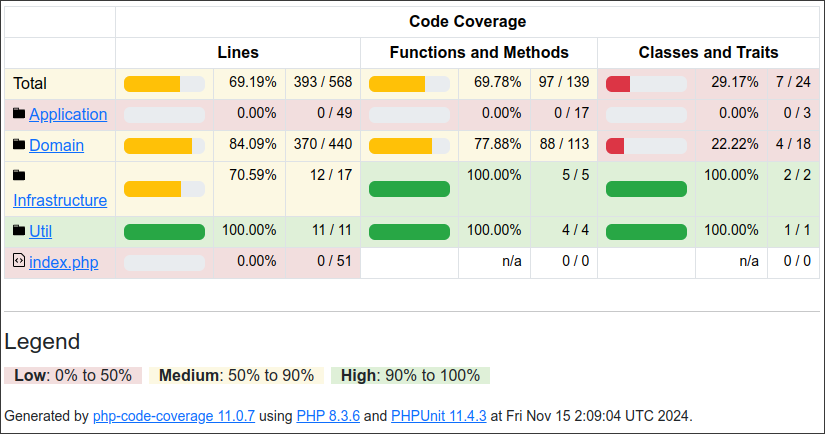
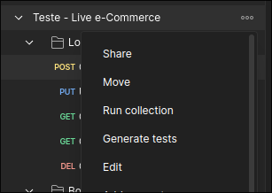

# Live eCommerce - Teste para PHP

## Sistema de Gerenciamento de Biblioteca

### Descrição do Projeto
MyLibrary é um sistema de gerenciamento de bibliotecas faz a gestão de livros, empréstimos, usuários e seções. Ele permite criar, atualizar e remover livros, gerenciar operações de empréstimo respeitando os limites dos usuários e garantir a disponibilidade dos livros. O sistema também inicializa a base de dados com dados de teste necessários e trata de exceções específicas para assegurar um funcionamento eficiente. Além disso, possui controladores que organizam as requisições HTTP para os serviços apropriados, proporcionando uma interface de uso eficiente e organizada.

### Requisitos atendidos

1. ✅ **Classes e Objetos**
2. ✅ **Encapsulamento**
3. ✅ **Herança e Polimorfismo**
  3.1 Classe abstrata `User` herdada por `Student` e `Professor` para tratamento diferenciado. - **Student**: Pode fazer um empréstimo por vez. - **Professor**: Pode fazer até 3 empréstimos por vez.
4. ✅ **DDD (Domain-Driven Design)**:
```
app/library/
├── App/
│   ├── Application/
│   │   ├── Controllers/
│   │   │   ├── BookController.php
│   │   │   ├── LoanController.php
│   │   └── Utils/
│   │       ├── Response.php
│   ├── Domain/
│   │   ├── Entities/
│   │   ├── Repositories/
│   │   ├── Services/
│   ├── Infrastructure/

```

5. ✅ **Persistência**
6. ✅ **Test Coverage**


#### para mais detalhes sobre a cobertura dos testes  👇🏼
 6.1. ir para diretório coverageTests
 ``` shell
 cd coverageTests
 ```
 6.2 subir o servidor utilizando o PHP
 ```shell
 php -S localhost:8000
 ```
 6.3 acessar via browser todos os detalhes sobre a cobertura dos testes
 [http://localhost:8080](http://localhost:8080)

7. ✅ **sintaxe PSR-2**
8. ✅ **Documentação**

[Code Documentation](https://rudeboyone.github.io/library-management/)

### Como executar o projeto

> Dependências: php 8.3 e sqlite 3

1. cloar o repositório
 ```
git clone https://github.com/RudeBoyOne/library-management.git
```

2. entre no diretório do projeto
```shell
cd library-management
```

3. execute o comando para popular o banco de dados
```shell
php App/Infrastructure/Persistence/Database/initialize_db.php
```

4. entrar no diretório App e subir o servidor utilizando o PHP
```shell
cd App

php -S localhost:8080
```

3. Import no postman o arquivo da collection com todas as requisições http para testar o sistema

como importa:

[Documentação postman, como importar uma collection](https://learning.postman.com/docs/getting-started/importing-and-exporting/importing-data/)

[Arquivo Collection](<documentation/Teste - Live e-Commerce.postman_collection.json>)

4. Selecione a opção "Run collection"

